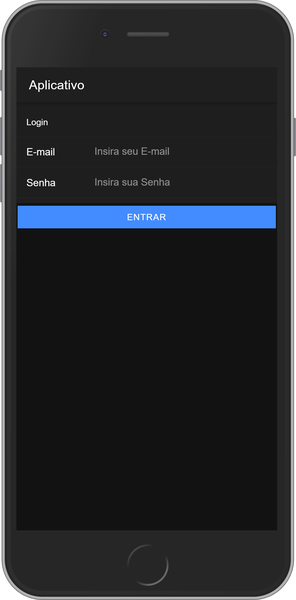
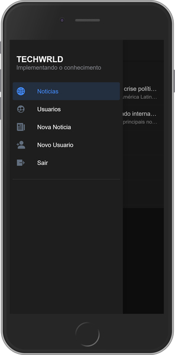
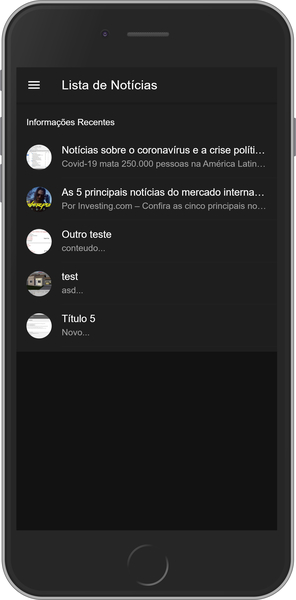
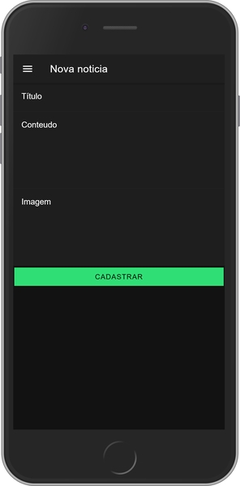
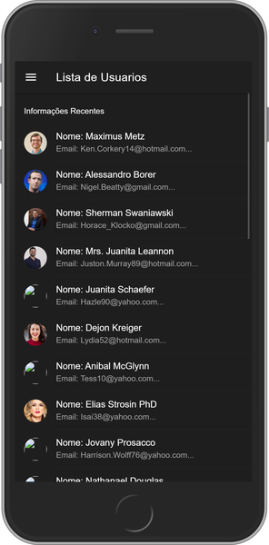
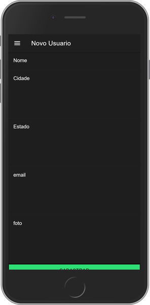

#Para que o aplicativo funcione, é necessário, digitar "chrome.exe --user-data-dir="C:/Chrome dev session" --disable-web-security" no executar do windows,
para que abra o google chrome com algumas seguranças desativadas.
, 
,  
,  
#Imagens do Sistema
 

 

